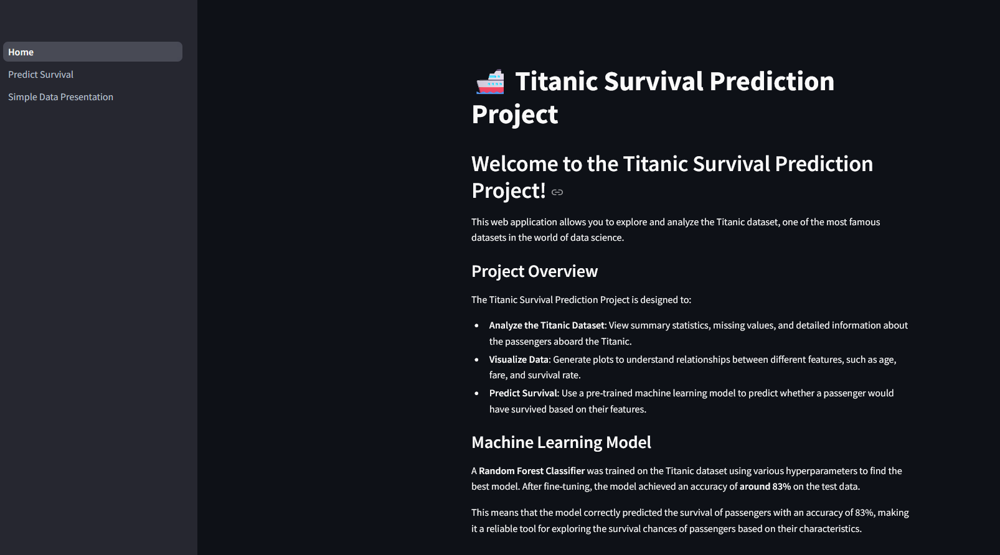

# 🚢 Titanic Survival Prediction Project

This project is a web application built with **Streamlit** that allows users to explore the Titanic dataset, visualize the data, and predict whether a passenger would have survived based on various features. The machine learning model used for prediction is a **Random Forest Classifier**, which achieved an accuracy of around **83%**.


## Table of Contents

- [Overview](#overview)
- [Features](#features)
- [Demo](#demo)
- [Installation](#installation)
- [Usage](#usage)
- [Screenshots](#screenshots)
- [Model Details](#model-details)
- [Contributing](#contributing)
- [License](#license)
- [Contact](#contact)

## Overview

The Titanic Survival Prediction Project is designed to provide a user-friendly interface for analyzing the famous Titanic dataset. Users can upload their own Titanic CSV files, explore the data, visualize relationships between different features, and predict survival using a pre-trained machine learning model.

This project is ideal for anyone looking to understand how machine learning models are applied to real-world datasets, as well as for those interested in learning more about the passengers aboard the Titanic.

## Features

- **Data Exploration**: Upload your Titanic dataset and explore summary statistics, data distribution, and missing values.
- **Data Visualization**: Generate interactive plots to understand relationships between features such as age, fare, and survival rate.
- **Survival Prediction**: Input passenger details to predict whether they would have survived the Titanic disaster using the trained model.

## Demo

You can access a live demo of the project [link not working](https://link_to_your_demo.com). <!-- Replace with your demo link -->

 <!-- Update with the actual path to your screenshot -->

## Installation

To run this project locally, follow these steps:

1. **Clone the repository**:
   ```bash
   git clone https://github.com/your_username/titanic-survival-prediction.git
   cd titanic-survival-prediction
   ```

2. **Create a virtual environment (optional but recommended)**: 
    ```bash
    python3 -m venv venv
    source venv/bin/activate  # On Windows use `venv\Scripts\activate`
    ```
3. **Install the dependencies**:
   ```bash
   pip install -r requirements.txt
    ```
4. Run the Streamlit app:
    ```bash 
   streamlit run main.py
    ```
## Usage

Once the app is running, you can interact with its various features:

- **Upload a Titanic CSV file**: Start by uploading a Titanic dataset CSV file.
- **Explore the Data**: Use the checkboxes to view summary statistics, data info, and missing values.
- **Visualize the Data**: Select columns to plot and analyze relationships between features.
- **Predict Survival**: Enter passenger details to see if they would have survived.

### Example CSV File

Ensure your CSV file contains the following columns:

- `PassengerId`
- `Survived`
- `Pclass`
- `Name`
- `Sex`
- `Age`
- `SibSp`
- `Parch`
- `Ticket`
- `Fare`
- `Cabin`
- `Embarked`

## Screenshots

### Data Exploration

 <!-- Update with the actual path to your screenshot -->

### Data Visualization

 <!-- Update with the actual path to your screenshot -->

### Survival Prediction

 <!-- Update with the actual path to your screenshot -->

## Model Details

The machine learning model used in this project is a **Random Forest Classifier**. The model was trained on the Titanic dataset and fine-tuned using GridSearchCV to achieve an accuracy of **83%**.

### Model Training

- **Algorithm**: Random Forest Classifier
- **Parameters**: Tuned using GridSearchCV
- **Accuracy**: 83%

The model predicts survival based on the following features:

- **Pclass**: Passenger class (1st, 2nd, or 3rd)
- **Sex**: Gender of the passenger
- **Age**: Age of the passenger
- **SibSp**: Number of siblings or spouses aboard
- **Parch**: Number of parents or children aboard
- **Fare**: Ticket fare paid
- **Embarked**: Port of embarkation (C, Q, S)
